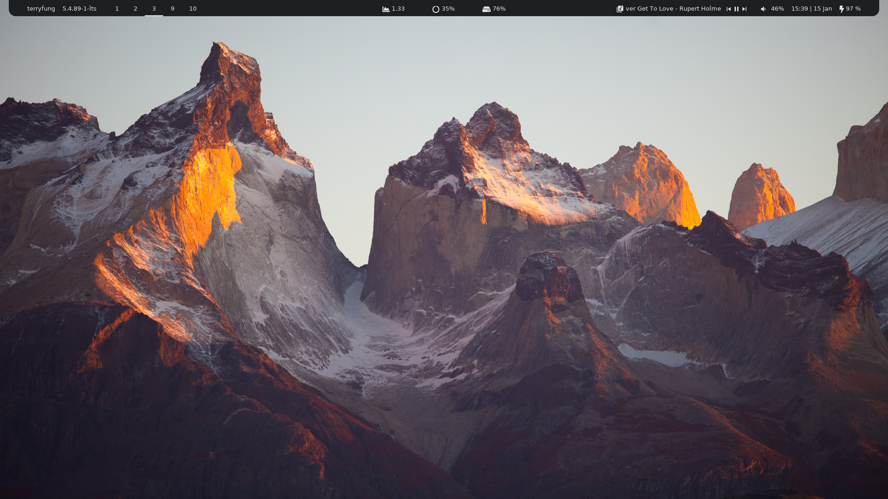

#### [bar/transparent]

#### [bar/bar]

#### Fonts used:
- [Yosemite San Francisco Font](https://github.com/supermarin/YosemiteSanFranciscoFont)
- Material Icon
- Fontawesome

#### Modules:
- username
- kernel version
- bspwm
- load average
- memory
- drive space
- pulseaudio
- date time
- battery
